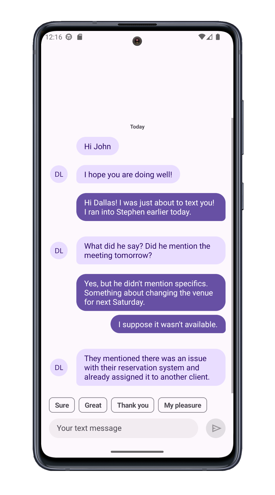

<!-- default badges list -->
[](https://docs.devexpress.com/GeneralInformation/403183)
<!-- default badges end -->

# Use DevExpress .NET MAUI Components to Build a Chat View

This example uses DevExpress .NET MAUI Components to display a chat view with sender and receiver messages, suggested quick replies, and response input controls.



## Included Controls and Their Properties

* [DXContentPresenter](https://docs.devexpress.com/MAUI/DevExpress.Maui.Core.DXContentPresenter): [Content](https://docs.devexpress.com/MAUI/DevExpress.Maui.Core.DXBorder.Content), [HorizontalOptions](https://learn.microsoft.com/en-us/dotnet/api/microsoft.maui.controls.view.horizontaloptions?view=net-maui-8.0)
* [DXBorder](https://docs.devexpress.com/MAUI/DevExpress.Maui.Core.DXBorder): [VerticalOptions](https://learn.microsoft.com/en-us/dotnet/api/microsoft.maui.controls.view.verticaloptions?view=net-maui-8.0), [IsVisible](https://learn.microsoft.com/en-us/dotnet/api/microsoft.maui.controls.visualelement.isvisible?view=net-maui-8.0)
* [Label](https://learn.microsoft.com/en-us/dotnet/maui/user-interface/controls/label?view=net-maui-8.0): [Text](https://learn.microsoft.com/en-us/dotnet/api/microsoft.maui.controls.label.text?view=net-maui-8.0)
* [DXCollectionView](https://docs.devexpress.com/MAUI/DevExpress.Maui.CollectionView.DXCollectionView): [GroupHeaderTemplate](https://docs.devexpress.com/MAUI/DevExpress.Maui.CollectionView.DXCollectionView.GroupHeaderTemplate), [AllowGroupCollapse](https://docs.devexpress.com/MAUI/DevExpress.Maui.CollectionView.DXCollectionView.AllowGroupCollapse), [ItemsSource](https://docs.devexpress.com/MAUI/DevExpress.Maui.CollectionView.DXCollectionView.ItemsSource), [ItemTemplate](https://docs.devexpress.com/MAUI/DevExpress.Maui.CollectionView.DXCollectionView.ItemTemplate)
* [SafeKeyboardAreaView](https://docs.devexpress.com/MAUI/DevExpress.Maui.Core.SafeKeyboardAreaView)
* [ChipGroup](https://docs.devexpress.com/MAUI/DevExpress.Maui.Editors.ChipGroup): [ChipTapCommand](https://docs.devexpress.com/MAUI/DevExpress.Maui.Editors.ChipGroup.ChipTapCommand), [ItemsSource](https://docs.devexpress.com/MAUI/DevExpress.Maui.Editors.ChipGroup.ItemsSource), [IsMultiline](https://docs.devexpress.com/MAUI/DevExpress.Maui.Editors.ChipGroup.IsMultiline), [DisplayMember](https://docs.devexpress.com/MAUI/DevExpress.Maui.Editors.ChipGroup.DisplayMember)
* [TextEdit](https://docs.devexpress.com/MAUI/DevExpress.Maui.Editors.TextEdit): [PlaceholderText](https://docs.devexpress.com/MAUI/DevExpress.Maui.Editors.EditBase.PlaceholderText), [Text](https://docs.devexpress.com/MAUI/DevExpress.Maui.Editors.TextEditBase.Text)
* [DXButton](https://docs.devexpress.devx/MAUI/DevExpress.Maui.Core.DXButton): [Command](https://docs.devexpress.com/MAUI/DevExpress.Maui.Core.DXButtonBase.Command), [Icon](https://docs.devexpress.devx/MAUI/DevExpress.Maui.Core.DXContentPresenter.Icon)

## Implementation Details
1. Use a `SafeKeyboardAreaView` as the root for the view layout. This way, the device keyboard will not overlap the message view when it appears.

    ```xaml
    <dx:SafeKeyboardAreaView> 
        ... 
    </dx:SafeKeyboardAreaView>
    ```
1. Use the `DXCollectionView` control to display messages. Specify the data source and item templates (use different templates for sender and receiver). Groups items using a built-in algorithm that uses date/time ranges ("Today", "Yesterday", "Last Week", and so on). Specify a template for group headers. 

    ```xaml
        <dxcv:DXCollectionView
        ItemsSource="{Binding Messages}"
        ItemTemplate="{local:MessageTemplateSelector SenderTemplate=..., RecipientTemplate=...}"
        GroupHeaderTemplate="{StaticResource dayGroupTemplate}"
        ...
        >
            <dxcv:DXCollectionView.GroupDescription>
                <dxcv:GroupDescription FieldName="SentAt" GroupInterval="DateRange" />
            </dxcv:DXCollectionView.GroupDescription>
        </dxcv:DXCollectionView>
    ```
2. Use `DXContentPresenter` components to define templates for sender and receiver messages. 

    ```xaml
        <ContentPage.Resources>
                <DataTemplate x:Key="senderMessageTemplate"  x:DataType="{x:Type local:Message}">
                    <dx:DXContentPresenter ... >
                    </dx:DXContentPresenter>
                </DataTemplate>
                <DataTemplate x:Key="recipientMessageTemplate" x:DataType="{x:Type local:Message}">
                    <dx:DXContentPresenter ... >
                    </dx:DXContentPresenter>
                </DataTemplate>
                ...
        </ContentPage.Resources>
    ```
2. Call the [`DXCollectionView.ScrollTo()`](https://docs.devexpress.devx/MAUI/DevExpress.Maui.CollectionView.DXCollectionView.ScrollTo(System.Int32)) method to scroll the view to the last message:

    ```csharp
    public partial class MainPage : ContentPage {
        // ...
        void OnMessagesCollectionChanged(object sender, NotifyCollectionChangedEventArgs e) {
            chatSurface.ScrollTo(chatSurface.GetItemHandle(vm.Messages.Count - 1));
        }
    }
    ```
    
3. Use the [`ChipGroup`](https://docs.devexpress.devx/MAUI/DevExpress.Maui.Editors.ChipGroup) control to display short answers:

    ```xaml
    <dxe:ChipGroup ...      
        DisplayMember="Text"
        ItemsSource="{Binding SuggestedActions}" />
    ```

    ```csharp
    public ChatViewModel() {
        // ...
        SuggestedActions = new ObservableCollection<SuggestedAction>() {
            new SuggestedAction() { Message = new Message() { Sender = Me, SentAt = DateTime.Now, Text = "Sure" }, Text = "Sure" },
            new SuggestedAction() { Message = new Message() { Sender = Me, SentAt = DateTime.Now, Text = "Great" }, Text = "Great" },
            new SuggestedAction() { Message = new Message() { Sender = Me, SentAt = DateTime.Now, Text = "Thank you" }, Text = "Thank you" },
            new SuggestedAction() { Message = new Message() { Sender = Me, SentAt = DateTime.Now, Text = "My pleasure" }, Text = "My pleasure" }
        };
    }
    ```

## Files to Review

- [MainPage.xaml](./CS/MainPage.xaml)
- [MainPage.xaml.cs](./CS/MainPage.xaml.cs)
- [ChatViewModel.cs](./CS/ChatViewModel.cs)

## Documentation

* [DXContentPresenter](https://docs.devexpress.com/MAUI/DevExpress.Maui.Core.DXContentPresenter)
* [DXCollectionView](https://docs.devexpress.com/MAUI/DevExpress.Maui.CollectionView.DXCollectionView)
* [DXBorder](https://docs.devexpress.com/MAUI/DevExpress.Maui.Core.DXBorder)
* [SafeKeyboardAreaView](https://docs.devexpress.com/MAUI/DevExpress.Maui.Core.SafeKeyboardAreaView)
* [ChipGroup](https://docs.devexpress.com/MAUI/DevExpress.Maui.Editors.ChipGroup)
* [TextEdit](https://docs.devexpress.com/MAUI/DevExpress.Maui.Editors.TextEdit)

## More Examples

* [DevExpress .NET MAUI Demo Center](https://github.com/DevExpress-Examples/maui-demo-app)
* [Stocks App](https://github.com/DevExpress-Examples/maui-stocks-mini)
* [Data Grid](https://github.com/DevExpress-Examples/maui-data-grid-get-started)
* [Data Form](https://github.com/DevExpress-Examples/maui-data-form-get-started)
* [Data Editors](https://github.com/DevExpress-Examples/maui-editors-get-started)
* [Charts](https://github.com/DevExpress-Examples/maui-charts)
* [Scheduler](https://github.com/DevExpress-Examples/maui-scheduler-get-started)
* [Tab Page](https://github.com/DevExpress-Examples/maui-tab-page-get-started)
* [Tab View](https://github.com/DevExpress-Examples/maui-tab-view-get-started)
* [Drawer Page](https://github.com/DevExpress-Examples/maui-drawer-page-get-started)
* [Drawer View](https://github.com/DevExpress-Examples/maui-drawer-view-get-started)
* [Collection View](https://github.com/DevExpress-Examples/maui-collection-view-get-started)
* [Popup](https://github.com/DevExpress-Examples/maui-popup-get-started)
